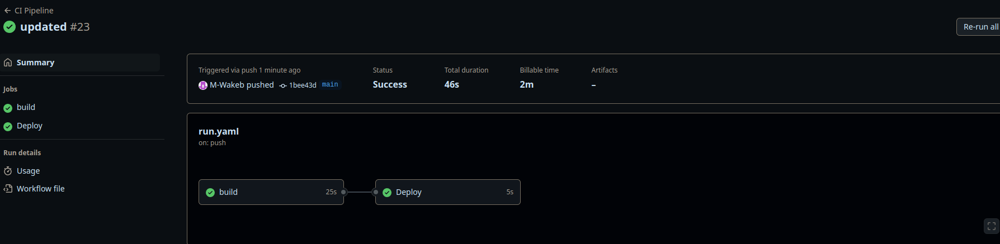
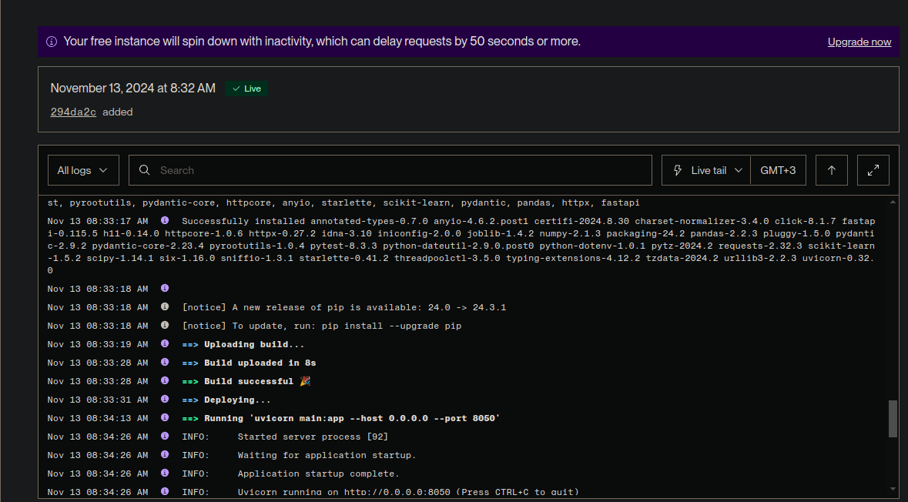
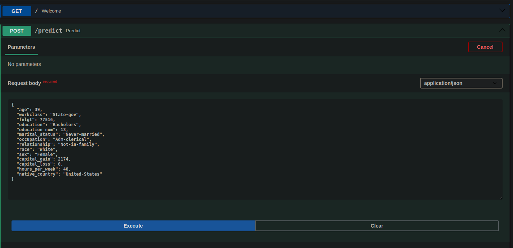
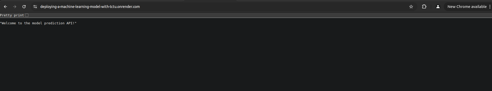
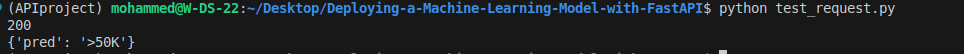

# Project: Deploying a ML Model to Cloud Application Platform with FastAPI for UDACITY COURSE
This projet uses the skills acquired in the course to develop a classification model.

## Highlights:
- FastAPI
- Github
- Github Actions
- Render
- Pytest
- scikit-learn
- flake8

## Github Action
[Yaml](.github/workflows/run.yaml)
## Model Card
[Model card](./model_card.md)
## Slices
[Slices output](./slice_output.txt)
## Integration

## Deployment

## FastAPI

## Get

## Post

